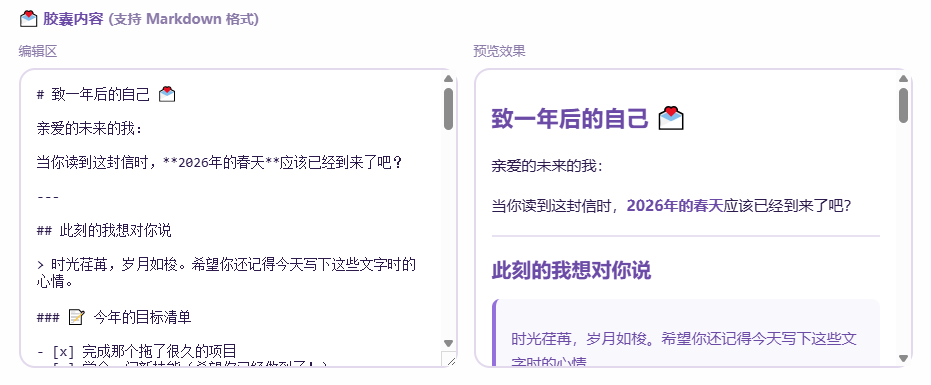
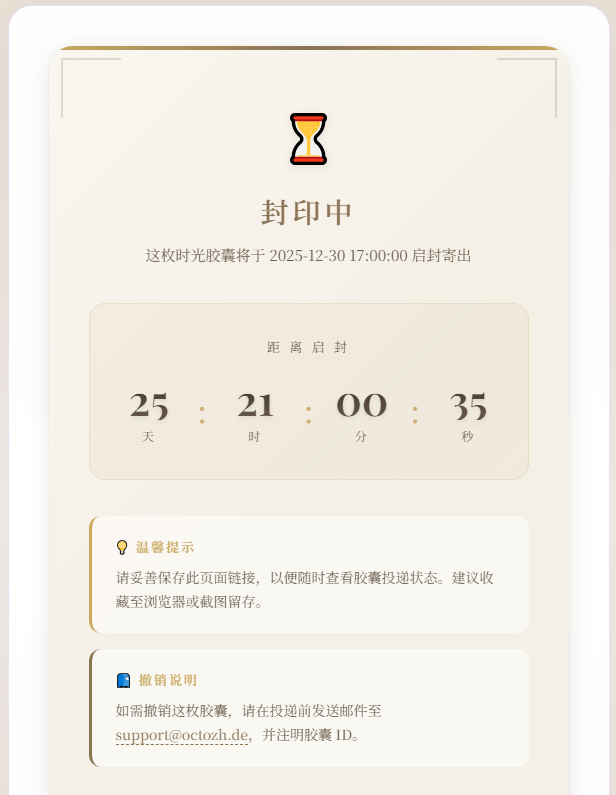
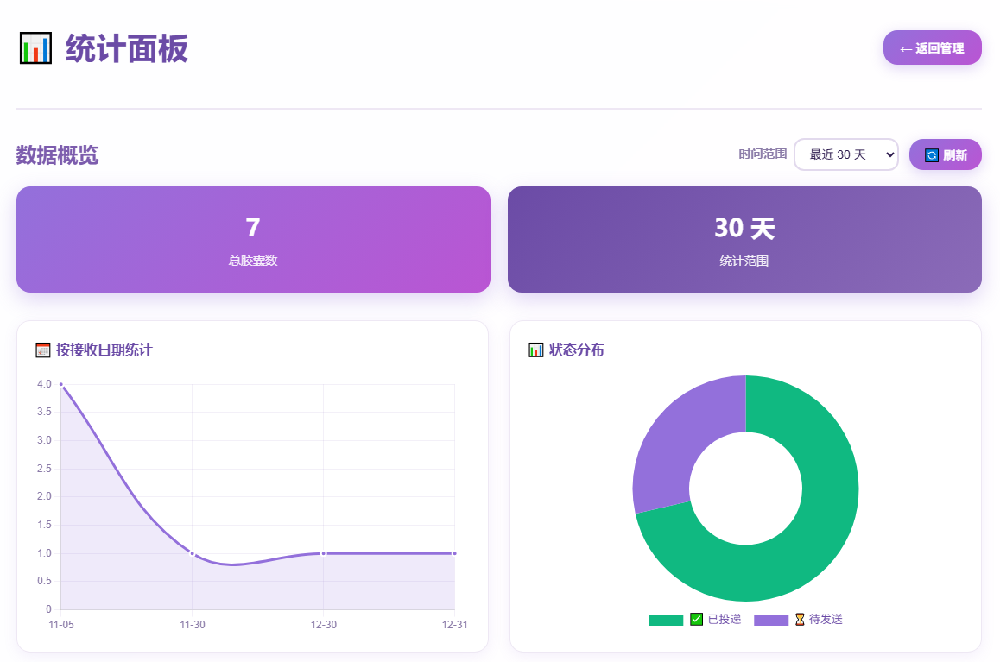
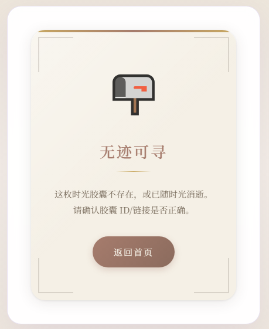

# ⏰ 时间胶囊 (Time Capsule)

一个时间胶囊服务，让用户可以给未来的自己或他人发送定时邮件。支持 Cloudflare Workers 和 Docker 两种部署方式。

## 🌟 项目特色

- **📝 Markdown 支持**：支持富文本格式，包括表格、TODO 列表、代码块、图片等
- **⏰ 智能定时**：基于北京时间（Asia/Shanghai）的精准定时投递
- **📊 状态追踪**：实时查看胶囊投递状态，带倒计时显示
- **🎲 快捷投递**：支持快捷选择（1/2/3/6个月、1年）和随机日期

## 📸 界面预览

| Markdown 渲染 | 投递状态 |
|:---:|:---:|
|  |  |

| 统计面板 | 错误ID |
|:---:|:---:|
|  |  |

## 🏗️ 技术架构

### Cloudflare 版本
- **运行时**：Cloudflare Workers
- **数据库**：Cloudflare D1 (SQLite)
- **邮件服务**：Resend API
- **计划任务**：Cron Triggers

### Docker 版本
- **运行时**：Node.js 20 + Hono
- **数据库**：SQLite (better-sqlite3)
- **邮件服务**：Resend API
- **计划任务**：node-cron

## 🗄️ 数据库结构

### 主表：capsules
存储时间胶囊的核心信息：
- `id`: 唯一标识符
- `email`: 收件人邮箱
- `content`: 胶囊内容
- `send_at`: 投递时间
- `status`: 投递状态
- `provider_email_id`: 邮件服务商 ID

### 限流表
- `rate_limit_daily`: IP 每日限流
- `rate_limit_bucket`: IP 10分钟桶限流

### 日志表
- `sends_log`: 发送日志和事件记录

### 设置表
- `settings`: 站点配置参数

## 🚀 快速部署

本项目支持两种部署方式，选择适合你的：

| 部署方式 | 适用场景 | 优势 |
|---------|---------|------|
| Cloudflare Workers | 无服务器、全球边缘 | 免费额度大、无需维护服务器 |
| Docker | 自托管、私有部署 | 完全掌控数据、可离线运行 |

---

## ☁️ Cloudflare Workers 部署

### 前置要求
- Node.js 18+
- npm
- wrangler CLI (`npm install -g wrangler`)
- Cloudflare 账号
- Resend 账号（发信 API、绑定邮箱域名、Webhook 配置）

### 1. 克隆项目
```bash
git clone <repository-url> 
cd timecapsule/cloudflare
```

### 2. 配置 Wrangler
```bash
# 登录 Cloudflare
npx wrangler login

# 创建 D1 数据库
npx wrangler d1 create timecapsule
# 记下返回的 database_id，用于下一步配置
```

### 3. 配置环境变量
创建 `wrangler.toml`（基于 `wrangler.toml.example`）并按个人喜好修改：

```toml
name = "timecapsule-worker"
main = "src/worker.ts"
compatibility_date = "2024-11-01"

[vars]
FROM_EMAIL = "Time Capsule <no-reply@yourdomain.com>"
BASE_URL = "https://your-domain.com"
DAILY_CREATE_LIMIT = "100"
CONTACT_EMAIL = "support@yourdomain.com"

[[d1_databases]]
binding = "DB"
database_name = "timecapsule"
database_id = "your-database-id"  # 替换为上一步获取的 ID

[triggers]
crons = ["*/1 * * * *"]
```

### 4. 初始化数据库

**本地开发环境：**
```bash
npx wrangler d1 execute timecapsule --local --file=schema.sql
```

**Cloudflare 线上环境：**
```bash
npx wrangler d1 execute timecapsule --file=schema.sql
```

### 5. 配置密钥

**推荐方式 - 使用 wrangler secret（密钥不会出现在代码中）：**
```bash
# 设置管理密码
npx wrangler secret put ADMIN_PASSWORD

# 设置 Resend API 密钥
npx wrangler secret put RESEND_API_KEY

# 可选：设置 Webhook 密钥
npx wrangler secret put RESEND_WEBHOOK_SECRET
```

**替代方式 - 在 wrangler.toml 中配置（不推荐，密钥会明文存储）：**
```toml
[vars]
ADMIN_PASSWORD = "your-admin-password"
RESEND_API_KEY = "your-resend-api-key"
RESEND_WEBHOOK_SECRET = "your-webhook-secret"  # 可选
```

### 6. 本地测试
```bash
npx wrangler dev
```

### 7. 部署到生产环境
```bash
npx wrangler deploy
```

### 8. 配置 Resend Webhook
在 Resend 控制台添加 Webhook URL：
```
https://your-domain.com/api/webhook/resend
```

## ⚙️ 环境变量

| 名称 | 说明 | 默认值 |
|------|------|--------|
| `ADMIN_PASSWORD` | 管理员密码 | 无 |
| `RESEND_API_KEY` | Resend API 密钥 | 无 |
| `RESEND_WEBHOOK_SECRET` | Webhook 签名密钥 | 无 |
| `FROM_EMAIL` | 发件人邮箱 | 无 |
| `BASE_URL` | 网站域名 | 无 |
| `CONTACT_EMAIL` | 联系邮箱 | 无 |
| `DAILY_CREATE_LIMIT` | 每日创建上限 | 100 |
| `IP_DAILY_LIMIT` | IP 每日限流 | 20 |
| `IP_10MIN_LIMIT` | IP 10分钟限流 | 5 |

---

## 🐳 Docker 部署

👉 详见 [docker/README.md](docker/README.md)

---

## 📊 管理面板

访问 `/admin`，输入管理员密码登录后可以：
- 查看胶囊列表和状态
- 调整站点设置（限流参数、最小提前量等）
- 导出数据（CSV/JSON）
- 删除胶囊

### 📈 统计面板

统计面板功能，提供丰富的数据可视化：
- **数据概览**：显示总胶囊数和统计时间范围
- **按接收日期统计**：折线图展示每日胶囊创建趋势
- **状态分布**：饼图显示各状态胶囊占比（待发送、已发送、已投递、拒收、失败）
- **按邮箱统计**：柱状图展示TOP 10收件人邮箱
- **按IP统计**：柱状图展示TOP 10创建者IP地址
- **时间范围选择**：支持7天、30天、90天、365天数据筛选
- **实时刷新**：一键刷新最新统计数据

统计面板使用Chart.js库实现美观的数据可视化，帮助管理员全面了解时间胶囊服务的使用情况和趋势。

## 📄 开源协议

MIT License

---

**时间胶囊** - 用心守护每一份关怀 💜